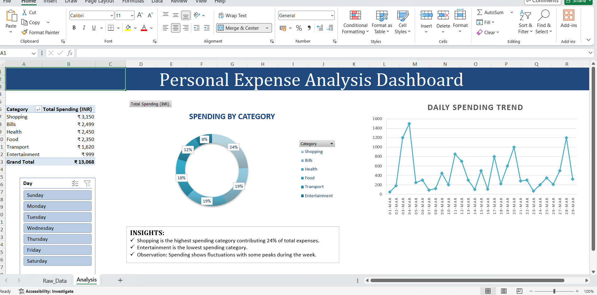
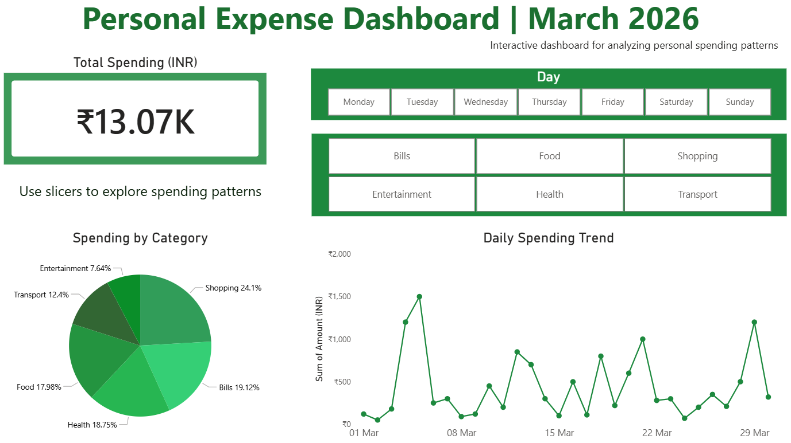

# Personal Expense Analysis Dashboard (Excel Project)

## 📊 Project Overview
This is an Excel-based dashboard designed to track and analyze personal spending. It provides insights into category-wise expenses and daily spending trends.

## 🛠️ Features
* **Interactive Slicers:** Filter data by day of the week.
* **Visual Analysis:** Doughnut charts for category distribution and line charts for daily trends.
* **Automated Summaries:** Powered by Pivot Tables for quick grand total calculations.

## 💡 Key Insights
* **Shopping** is the highest expense category at 24%.
* **Entertainment** remains the lowest spending area.
* Spending shows noticeable spikes during **mid-month**, indicating higher expenditure periods.

## 🚀 How to Use
1. Download the **Personal_expense_Analysis.xlsx** file.
2. Open in Microsoft Excel.
3. Use the **Day Slicer** on the left to filter the dashboard.

## 📚 What I Learned
* Data cleaning and structuring in excel.
* Creating Pivot tables for summarization.
* Building visual dashboards using charts.

## 📊 Power BI Dashboard

This project includes an interactive Power BI dashboard for analyzing personal expenses.

